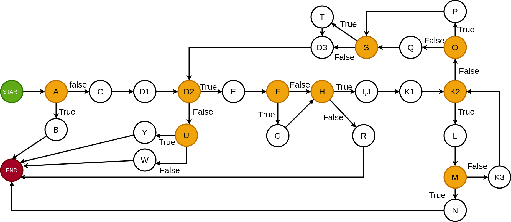
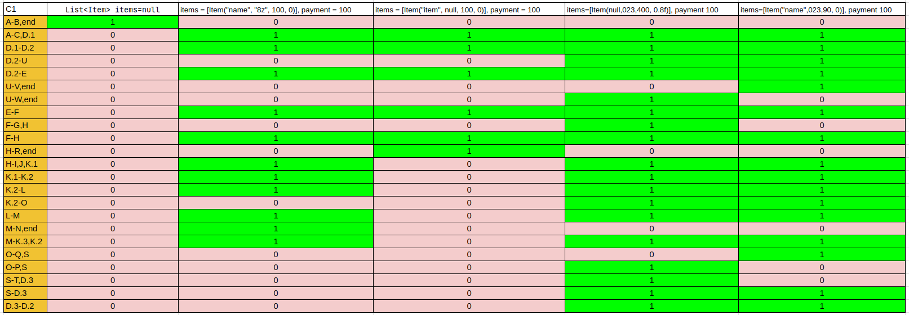
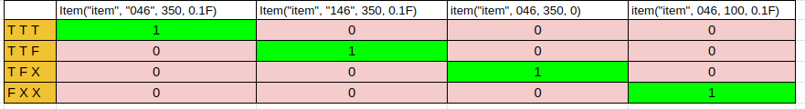

Petar Hristovski 223084

2. Control Flow Graph

3. цикломатската комплексност = 10
    
    -V(G)= E - N + 2 (Бројот на јазли се одзимаат од бројот на ребра и на тој резултат се додава плус 2)
   
    -Борење на борење на предикатни јазли + 1 (М = D + 1)
   
    -Со броење на сите региони.
   
4. Every Branch критериум

5. Multiple Condition критериум

